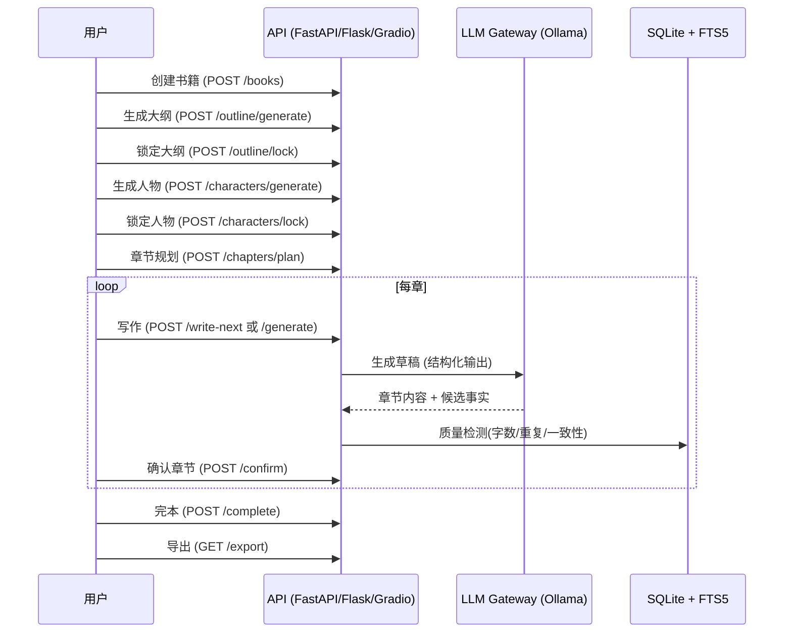

# Novel-Agent


**本地大模型驱动的长篇小说创作辅助引擎（本地大模型优先 + RAG + 分层摘要）**

> 当前阶段：**Phase 2.2** —— few-shot 风格一致性 + RAG 事实检索 + 分层摘要 + 章节序号修复

## 目录
- [快速开始](#快速开始)
- [三大使用模式](#三大使用模式)
- [环境要求](#环境要求)
- [配置说明](#配置说明)
- [API 文档](#api-文档)
- [核心流程](#核心流程)
- [架构决策](#架构决策为何不使用-langchain--langgraph)
- [质量门禁与一致性](#质量门禁与一致性)
- [测试](#测试)
- [故障排查](#故障排查)
- [项目结构](#项目结构)
- [许可证](#许可证)

---

## 快速开始

### 方式一：Windows 一键启动（推荐新手）
```cmd
# 双击运行
start.bat
```
> 自动启动 Flask WebUI (http://127.0.0.1:7860) 并打开浏览器

### 方式二：Python 直接运行
```powershell
# 1. 安装依赖
pip install -e ".[dev]"

# 2. 复制配置
Copy-Item .env.example .env

# 3. 初始化数据库
python scripts/migrate.py

# 4a. 启动 FastAPI 服务（仅 API，端口 8000）
python server.py

# 4b. 启动 Flask WebUI（三模式界面，端口 7860）
python webui.py

# 4c. CLI 演示（无需前端）
python scripts/demo_user_flow.py --max-chapters 3
```

### 方式三：Docker（待补充 Dockerfile）
```bash
# TODO: docker compose up -d
```

---

## 三大使用模式

| 模式 | 适用场景 | 入口 | 特点 |
|------|----------|------|------|
| **基础版** | 想快速得到一本完整小说 | WebUI "基础版" / CLI | 只需书名，自动完成：人物→大纲→章节规划→全书写作→确认→完本→导出 |
| **进阶版** | 想精细控制每一步 | WebUI "进阶版" | 6 步引导：创作卡片 → 人物设计 → 大纲 → 章节规划 → 逐章写作(含润色/一致性检查) → 完本导出 |
| **高级版** | 已有大纲/梗概文本 | WebUI "高级版" | 上传 .txt/.md 大纲 → 自动解析结构 → 接入进阶版流程 |

> **WebUI** (Flask + 原生 JS/CSS)：暖阳奶油风，轻量，单文件部署，端口 7860

---

## 环境要求

| 组件 | 最低版本 | 推荐 | 说明 |
|------|----------|------|------|
| Python | 3.11 | 3.11+ | 运行 API/脚本/UI |
| Ollama | 0.3.x | 最新 | `ollama pull qwen2.5:7b-instruct` |
| 显存 | — | **≥6 GB** | 7b 模型量化后约 4.7 GB VRAM |
| 内存 | 8 GB | 16 GB+ | CPU 推理回退时需更大内存 |
| 磁盘 | 10 GB | 20 GB+ | 模型权重 + SQLite + 导出文件 |

> ⚠️ **CPU 推理**：无 GPU 时 Ollama 自动回退，速度约为 GPU 的 1/10-1/20，仅建议测试用。

---

## 配置说明

所有配置通过 `.env` 读取（优先级：环境变量 > `.env` > 默认值）。  
复制 `.env.example` 为 `.env` 后按需修改。

| 变量 | 默认值 | 说明 | 必填 |
|------|--------|------|------|
| `OLLAMA_BASE_URL` | `http://127.0.0.1:11434` | Ollama HTTP 端点 | 是 |
| `OLLAMA_MODEL` | `qwen2.5:7b-instruct` | 已 `ollama pull` 的模型名 | 是 |
| `OLLAMA_THINK` | `false` | 推理模型需关闭以输出纯 JSON（qwen3/qwq 必须关） | 否 |
| `CONTEXT_LIMIT` | `6144` | 传给 Ollama 的 num_ctx；6144 可覆盖实测 prompt+输出总长，避免 4096 默认值下 >4096 token 的 prompt 被静默截断 | 否 |
| `DEFAULT_NUM_PREDICT` | `2048` | 单次生成默认 token 上限 | 否 |
| `SCHEMA_REPAIR_RETRIES` | `1` | JSON 修复重试次数 | 否 |
| `DATABASE_URL` | `sqlite:///data/novel_agent.db` | SQLAlchemy 连接串 | 否 |
| `WORDS_SHORT` | `30000` | 短篇目标总字数 | 否 |
| `WORDS_MEDIUM` | `120000` | 中篇目标总字数 | 否 |
| `WORDS_LONG` | `300000` | 长篇目标总字数 | 否 |
| `PREV_CHAPTER_TAIL_CHARS` | `1500` | 上文回溯字符数（压缩以腾出输出上下文） | 否 |
| `MAX_FACTS_IN_CONTEXT` | `50` | 上下文注入的最大事实条数（RAG 已启用，取 50 条兜底） | 否 |
| `FEW_SHOT_SAMPLE_CHARS` | `600` | few-shot 风格示例字符数（从上一章开头抽取，0=关闭） | 否 |
| `BANNED_PHRASES_PER_CHAPTER` | `5` | 跨章禁用表达清单条数（从最近 3 章已确认正文抽取高频短语注入提示词，0=关闭） | 否 |
| `BANNED_PHRASE_MIN_HITS` | `3` | 短语在最近 3 章正文中出现达到该次数才纳入禁用清单 | 否 |
| `MAX_CHAPTER_WORDS` | `2000` | 单章目标字数上限，大纲目标超出时自动拆章 | 否 |
| `REPEAT_PENALTY` | `1.18` | 重复惩罚（Ollama 默认 1.1；1.18 抑制中文长文退化循环，过高 1.25+ 可能导致词汇贫乏） | 否 |
| `RUN_CONSISTENCY_CHECK` | `false` | 章节生成时是否运行 LLM 一致性校验（默认关以提速；润色时始终执行） | 否 |
| `WRITER_NUM_PREDICT_FLOOR` | `3072` | 写作最小 token 预算（由代码根据上下文余量动态计算） | 否 |
| `WRITER_MIN_WORDS_RATIO` | `0.5` | 实际字数/目标字数 < 此值判定不足（0.5 = 下限为目标字数一半，最低 400 字） | 否 |
| `WRITER_REPAIR_REPETITION` | `true` | 是否启用重复检测+重写 | 否 |
| `WRITER_MAX_REPAIR` | `0` | 单章最大扩写/重写轮数（默认关闭以提速；重复问题已在采样端抑制 + 后处理去重） | 否 |
| `WRITER_MAX_TRIM_RATIO` | `0.25` | 去重截断比例 ≥ 此值触发重写 | 否 |
| `WRITER_ENFORCE_QUALITY_ON_CONFIRM` | `true` | 质量不达标时自动确认是否跳过 | 否 |
| `ARC_SUMMARIES_IN_CONTEXT` | `5` | 注入的卷摘要数量（每10章压缩） | 否 |
| `MEGA_ARC_SUMMARIES_IN_CONTEXT` | `3` | 注入的大卷摘要数量（每50章压缩） | 否 |

---

## API 文档

基础路径：`/api/v1`  
统一响应：`{ success, data, error, meta }`  
错误码：`NOT_FOUND(404)`, `VERSION_CONFLICT(409)`, `PRECONDITION_FAILED(412)`, `EXPORT_FORMAT(412)`, `INTERNAL_ERROR(500)`

> ⚠️ **状态说明**：FastAPI 层（`server.py`）仅保留作外部 API 集成参考。主要使用入口是 WebUI（`webui.py`，端口 7860），一键启动脚本只启动后者。

### 核心端点（22 个，完整列表见 `/docs`）

| 端点 | 方法 | 说明 |
|------|------|------|
| `/books` | POST | 创建书籍（创作卡片） |
| `/books/{id}` | GET | 获取书籍详情 |
| `/books/{id}/outline/generate` | POST | 基于卡片+人物生成分层大纲 |
| `/books/{id}/outline/lock` | POST | 锁定大纲（版本控制） |
| `/books/{id}/characters/generate` | POST | 生成人物设定 |
| `/books/{id}/characters/lock` | POST | 锁定人物 |
| `/books/{id}/chapters/plan` | POST | 大纲节点映射为章节，按篇幅均分字数 |
| `/books/{id}/chapters/write-next` | POST | 写下一章（含幂等键） |
| `/chapters/{id}/generate` | POST | 指定章节生成/重写 |
| `/chapters/{id}/confirm` | POST | 确认章节（`force=true` 覆盖质量门禁） |
| `/books/{id}/complete` | POST | 完本（需全章 confirmed）→ 生成摘要 |
| `/books/{id}/export` | GET | 导出 txt（`scope=confirmed\|all`） |
| `/tasks/{id}` | GET | 查询异步任务状态 |

> 示例请求/响应见 [OpenAPI 文档](http://localhost:8000/docs)（启动 `python server.py` 后访问）。

---

## 核心流程



---

## 架构决策：为何不使用 langchain / langgraph

**结论：保持自研编排。** 本项目属于「确定性流水线 + 数据库状态推进」，而非自主 agent 图；langgraph 的核心价值（工具调用、条件路由、并行子图）在本项目无用武之地。

| 决策点 | 现状 | 引入框架的问题 |
|--------|------|----------------|
| **编排** | 自研状态机（`book_flow.py`）+ phase0 循环，任务表持久化，天然断点续跑 | langgraph checkpoint 抽象与自建 SQLite 状态重复，需重写核心 |
| **Agent 能力** | 全项目零 tool calling，无需自主决策 | 框架核心价值闲置，只增加抽象层 |
| **容错** | 自研 JSON schema 修复重试 + 字数/重复/一致性质量闸门 | 属于领域逻辑，框架不提供等价物，引入后仍需保留（双重实现） |
| **模型接入** | `gateway.py` 直连 Ollama（JSON mode/raw 精确控制），仅 113 行 | langchain 的 Ollama 抽象对本地小模型是隔层，关键参数难透传 |
| **依赖** | 17 个显式依赖，无传递膨胀，pydantic 版本可控 | langchain 依赖树庞大，与 FastAPI/SQLAlchemy 栈存在 pydantic 版本冲突风险 |

**触发引入的条件**（部分已满足）：
1. 需要自主 agent 式写作（模型自行决策调用工具/检索/改写）— 未满足
2. 需要多模型统一抽象（OpenAI/Claude/本地混用）— 未满足
3. ~~需要 RAG 检索增强~~ — **已自研实现**（FTS5 + bm25，无需引入框架）
4. 团队深度熟悉该生态，人效优先

**原则**：未来若需引入，先以最小模块（如 `phase0_loop.py`，137 行）做 POC 对照，验证收益后再决定是否重写。

---

## 长程一致性机制

长篇小说（100+章）面临的核心挑战：模型上下文有限，无法装入全部历史。本项目通过三层机制解决：

### 1. RAG 事实检索（FTS5 + bm25）
- **替代**"取最近 N 条事实"的朴素逻辑
- 基于章节标题/目标检索**最相关**的已确认事实
- SQLite FTS5 全文索引 + OR 查询 + bm25 相关性排序
- 中文逐字分词 + 90 词停用词表过滤高频虚字
- 兜底：RAG 结果不足时补充最近事实填满槽位

### 2. 分层摘要（压缩长程记忆）
- **卷摘要（arc summary）**：每 10 章自动压缩为 1 段摘要
- **大卷摘要（mega arc summary）**：每 50 章再压缩为 1 段
- 注入时从最远到最近排列，覆盖最多 150 章背景
- 生成时机：章节确认后自动触发（best-effort，不阻塞进度）

### 3. Few-shot 风格示例
- 从**已确认章节**的开头抽取 600 字作为风格锚点
- LLM 模仿前文的文风、语气、节奏、描写密度
- 第 1 章无前文时自动跳过，第 2 章起自动生效
- `FEW_SHOT_SAMPLE_CHARS=0` 可关闭

```
章节上下文构建顺序：
  硬设定(人物/世界观) → few-shot风格示例 → 分层摘要(远→近) → RAG事实 → 前章回溯 → 本章目标
```

---

## 质量门禁与一致性

| 机制 | 触发条件 | 行为 |
|------|----------|------|
| **字数达标** | `actual_words / target_words < WRITER_MIN_WORDS_RATIO (0.5)` | `quality_ok=false`，自动扩写（最多 `WRITER_MAX_REPAIR=0` 轮，默认关闭） |
| **重复检测** | 连续 n-gram 重复/循环复读/跨段重复句 | 截断重复段、删除后出现的重复句；若截断比例 ≥ `WRITER_MAX_TRIM_RATIO (0.25)` 触发重写 |
| **一致性校验** | 章节生成后自动运行 | 抽取候选事实 → 对比已确认事实库 → 产出 `error/warning/info` 级问题 |
| **润色修复** | 手动点击"修复+润色" | 基于校验问题定向重写，输出修复前后对比 |
| **确认门禁** | `quality_ok=false` 时 | 默认跳过自动确认；`force=true` 可强制通过（需配置允许） |

---

## 测试

```powershell
# 单元测试（无需 Ollama，约 10s）
pytest tests/unit -q

# 集成测试（需本地 Ollama + qwen2.5:7b-instruct）
pytest tests/integration -q -m integration

# 代码规范
ruff check src tests
mypy src
```

---

## 故障排查

| 现象 | 原因 | 解决 |
|------|------|------|
| `Connection refused` | Ollama 未启动 | `ollama serve` |
| `model not found` | 未拉取模型 | `ollama pull qwen2.5:7b-instruct` |
| `CUDA out of memory` | 显存不足 | 关闭其他进程 / 用更小量化模型 / CPU 模式 |
| `quality_ok=false` 章节不自动确认 | 字数不足或重复过多 | 调大 `WRITER_NUM_PREDICT_CEIL` / 手动 `force=true` 确认 |
| `VERSION_CONFLICT` | 并发修改同一实体 | 使用 `expected_version` 乐观锁重试 |
| `database is locked` | SQLite 并发写入 | 单进程运行 / 改用 PostgreSQL |
| 结构化输出解析失败 | `OLLAMA_THINK=true` 导致思考内容混入 JSON | 设置 `OLLAMA_THINK=false`（默认已关） |

---

## 项目结构

```
novel-agent/
├── server.py              # FastAPI 入口 (端口 8000)
├── webui.py               # Flask WebUI 入口 (端口 7860，三模式界面)
├── start.bat              # Windows 一键启动脚本
├── pyproject.toml         # 包配置 (依赖、pytest、版本)
├── .env.example           # 配置模板
├── alembic/               # 数据库迁移
├── prompts/               # 提示词模板
│   ├── planner/           # 大纲、人物生成
│   ├── writer/            # 章节起草、润色、卷摘要
│   ├── validator/         # 一致性校验
│   └── extractor/         # 候选事实抽取
├── scripts/
│   ├── demo_user_flow.py  # CLI 完整演示
│   ├── migrate.py         # 数据库初始化
│   ├── probe_models.py    # 模型能力探测
│   ├── benchmark_models.py # 模型推理速度基准测试
│   └── smoke_test_arc_summary.py # 分层摘要冒烟测试
├── src/novel_agent/
│   ├── api/               # FastAPI 路由、schemas、错误处理
│   ├── application/       # 工作流编排 (book_flow.py 核心)
│   ├── domain/            # 领域模型、错误、质量评估
│   ├── infrastructure/    # LLM网关、持久化(含FTS5)、提示词注册
│   └── settings.py        # Pydantic Settings 配置
├── templates/index.html   # Flask 前端模板
├── static/                # Flask 前端资源
├── tests/                 # 单测(61) + 集成测试
├── backups/               # 提示词/配置版本备份
└── data/                  # SQLite、导出文件、探测报告 (gitignore)
```

---

## 许可证

[MIT License](LICENSE) © 2024 Novel-Agent Contributors